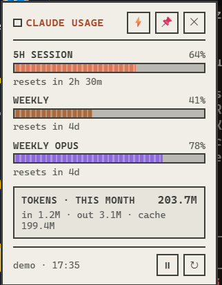
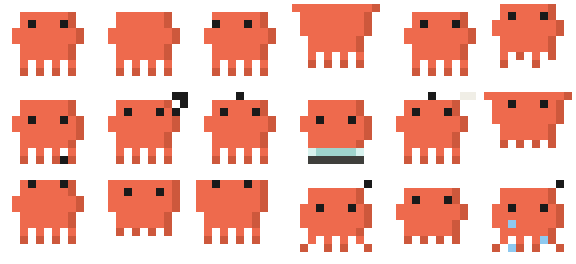
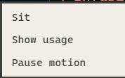

<h1 align="center">Mini Claude</h1>

<p align="center">
  
  
  
  
</p>

<p align="center">
  A tiny desktop pet that lives in the corner of your screen and shows how much
  of your Claude usage is left. He works while you work, dozes off when you
  don't, and sulks if you leave him sitting too long.
</p>

<p align="center">
  <strong>~40 MB of RAM. Under 5% of one CPU core when idle.</strong><br>
  Tauri v2 + Rust backend, vanilla HTML/CSS/JS frontend. No framework, no bundler.
</p>

---

## What it does

<table>
<tr>
<td width="52%" valign="top">

**Real usage, not a guess.** The 5-hour and weekly bars come straight from
Anthropic's `anthropic-ratelimit-unified-*` response headers, so they match what
`/usage` tells you in Claude Code. No estimating, no scraping.

**A token counter** for the current month, which flips to all-time when you
click it. Cache reads dominate that number by two orders of magnitude, so the
split is always shown underneath rather than hidden behind one big figure.

**He reacts to Claude Code.** A file watcher on `~/.claude/projects` notices
when a session starts writing and picks one of five working animations.

</td>
<td width="48%" valign="top">



</td>
</tr>
</table>

### Moods

| | | |
|---|---|---|
|  |  |  |
| **Idle** — breathes, blinks, and picks from fourteen different fidgets | **Low** — heavy lids past 90% of a limit | **Empty** — cries once a limit is actually spent |
|  |  |  |
| **Typing** — the plain working animation | **Laptop** — hauls one out and settles in behind it | **Files** — digs through papers, pages everywhere |
|  |  |  |
| **Sitting** — told to stay put, and he does | **Carried** — swings while you drag him around | **…and the rest** |

### Right-click him



- **Sit** — he settles down and stops fidgeting. This outranks everything except
  being picked up; he will not even get up to work. Ignore him for five to ten
  minutes and he takes himself off to the side and starts crying.
- **Show usage** — the panel, same as left-clicking him.
- **Pause motion** — freezes him completely. Remembered between runs.

<br clear="right">

### The rest of it

- **Drag him anywhere**, or move him with the arrow keys when he has focus.
- **Start with Windows** — the ⚡ button writes the registry `Run` entry.
- **Auto-opens** when a limit crosses 90%, and stays out of your way otherwise.
  Dismissing it means dismissed; it will not pop back up a minute later.
- **Keyboard and screen reader support throughout** — the panel is a labelled
  non-modal disclosure, the context menu implements the real menu keyboard
  contract, thresholds are announced once via a polite live region, and
  `prefers-reduced-motion` freezes him to a neutral pose.

---

## Setup

### 1. Install the prerequisites

You need **Node 18+**, **Rust**, and on Windows the **MSVC build tools**.

<details open>
<summary><strong>Windows</strong></summary>

```powershell
winget install OpenJS.NodeJS.LTS
winget install Rustlang.Rustup
winget install Microsoft.VisualStudio.2022.BuildTools
```

In the Visual Studio Build Tools installer, tick **Desktop development with
C++**. That is what provides the MSVC linker Rust needs.

WebView2 ships with Windows 11 and with any recent Windows 10. If the app
starts and shows nothing, install the
[WebView2 runtime](https://developer.microsoft.com/microsoft-edge/webview2/).
</details>

<details>
<summary><strong>macOS</strong></summary>

```bash
brew install node
curl --proto '=https' --tlsv1.2 -sSf https://sh.rustup.rs | sh
xcode-select --install
```
</details>

<details>
<summary><strong>Linux</strong></summary>

```bash
sudo apt install libwebkit2gtk-4.1-dev build-essential curl wget file \
     libxdo-dev libssl-dev libayatana-appindicator3-dev librsvg2-dev
curl --proto '=https' --tlsv1.2 -sSf https://sh.rustup.rs | sh
```

The Windows-only bits (auto-start, the registry entry) compile to no-ops.
</details>

### 2. Get it running

```bash
git clone https://github.com/AGHEORONO/mini-claude.git
cd mini-claude
npm install
npm run dev
```

The first build compiles the whole Rust dependency tree and takes a few
minutes. Every build after that is seconds.

For a real binary:

```bash
npm run build
```

The executable lands in `src-tauri/target/release/`, and an installer in
`src-tauri/target/release/bundle/`.

### 3. Point it at your usage

Nothing to configure. On first run it reads:

| What | Where | Used for |
|---|---|---|
| OAuth token | `~/.claude/.credentials.json` | one tiny API request whose **response headers** carry your real limits |
| Session logs | `~/.claude/projects/**/*.jsonl` | the Opus split, and the token totals |

If you are signed in to Claude Code, both already exist.

> **On that API request:** to read the rate-limit headers the app sends the
> smallest possible message (Haiku, `max_tokens: 1`). It costs a negligible
> amount of your quota, is cached for five minutes, and is rate limited to at
> most one call every 45 seconds. If it fails for any reason the app falls back
> to estimating from your local logs.

---

## Configuration

Everything lives in [`src/config.json`](src/config.json). Those values are
compiled into the binary, so to change them without rebuilding drop a partial
override at **`~/.mini-claude/config.json`** — it is merged over the defaults:

```json
{
  "dangerPct": 85,
  "exhaustedPct": 98
}
```

| Key | Default | Meaning |
|---|---|---|
| `dangerPct` | `90` | panel force-opens, he starts looking tired |
| `exhaustedPct` | `99` | out of tokens, he cries |
| `pollSeconds` | `300` | refresh interval (browser fallback only; the native build is event-driven) |
| `limits` | — | weighted-unit limits for the **fallback** estimate, when the API is unreachable |
| `weights` | — | how token kinds are weighted in that estimate |

> Save the override as **UTF-8 without a BOM**. A BOM is tolerated, but other
> JSON tooling will not thank you.

### Recalibrating the fallback

The `limits` numbers only matter when the real API cannot be reached. To check
them, run `/usage` in Claude Code and compare:

```bash
npm run usage
```

Nudge `limits` until the two agree.

---

## How it works

```
src/                  frontend — plain HTML/CSS/JS, no build step
  index.html          markup
  app.js              data, panel, menu, moods, state machine
  pixel.js            animation engine: frame stepping + tweened CSS 3D transforms
  frames.js           generated sprite sheet — do not edit
  config.json         the one source of truth for limits and thresholds
src-tauri/src/lib.rs  Rust: rate-limit headers, JSONL scanner, file watcher, auto-start
tools/                sprite, icon and README-artwork generators
ref/frames/           the reference art the sprite sheet is extracted from
```

**The animation.** The sprite steps at each clip's own frame rate, the way
pixel art should. What makes it read as fluid is a continuous motion track
running underneath — bob, breathe, lean, squash, a small turn — applied as a
real CSS 3D transform, with the ground shadow shrinking as he leaves the
ground. The loop is throttled to between 24 and 40 fps depending on the clip
and stops dead when the window is hidden, which is most of why idle CPU is what
it is.

**The scanner** reads each session log once and then only the bytes appended
since, keeping a byte offset per file. Deduplication is load-bearing rather
than a nicety: resuming a session copies its whole history into the new file,
which on a real install is over half of all the lines.

**Poses the reference art does not contain** — sitting, crying, the laptop, the
loose pages — are derived from existing frames in
[`tools/extract-frames.mjs`](tools/extract-frames.mjs) rather than drawn, so
they cannot drift away from the artwork.

### Regenerating the generated files

```bash
npm run frames     # ref/frames/*.png  ->  src/frames.js
npm run icon       # src/frames.js     ->  the app icon, every size
npm run showcase   # src/frames.js     ->  the GIFs in this README
```

> If you change the icon and the executable keeps the old one, `tauri-build`
> has not rerun. Touch `src-tauri/build.rs` and build again.

---

## Known limits

- **Opus is derived, not measured.** Anthropic's unified headers carry no
  per-model breakdown, so the Opus bar takes the share of your local weighted
  usage that was Opus and applies it to the real weekly percentage. On a plan
  where every model draws on one weekly budget that reads as "Opus has eaten
  this much of your week". If almost everything you run is Opus, expect that
  bar to sit on top of the weekly one — that is correct, not a bug.
- **Months are bucketed in UTC**, so a message within a few hours of a month
  boundary can land in the neighbouring month locally.
- **Auto-start is Windows only.** Everywhere else the button is hidden.
- Tested on Windows 11. The macOS and Linux paths compile but are unexercised.

## Credits

The character is a pixel-art tribute to Anthropic's Claude mascot. This is a
personal, unofficial project — not affiliated with or endorsed by Anthropic.

MIT licensed. See [LICENSE](LICENSE).
